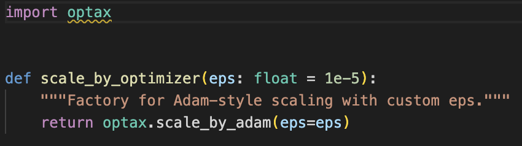
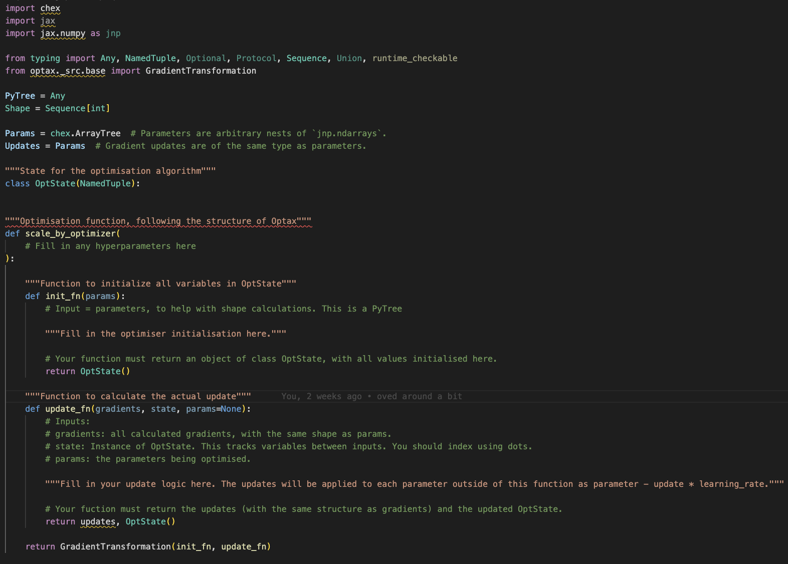

# 🪩 **How to Contribute a Task for DiscoGen**

Thank you for your interest in making a task for **DiscoGen**!
Your contribution is *hugely appreciated* and will help unlock new research in **automated research** and **algorithm discovery** using agentic LLMs.

---

## 🎯 Goal

The goal of **DiscoGen** is to develop a series of **modular tasks**, where an ML codebase is broken into its constituent components, for LLMs to use when discovering new algorithms. Through configs, we can choose which modules should use **default code** (the original implementation) and which should be **LLM-generated**. We want to ensure that LLMs can produce **performant, generalisable** algorithms for AI research.

---

## ⚙️ Getting Started

1. Follow the setup instructions from the [DiscoGen repository](https://github.com/AlexGoldie/discogen/) to prepare your environment.
2. Clone the repo and ensure everything runs correctly.
3. Follow the guide below to create your own task.

---

## 📁 Directory Structure Example

Here, we will use **OnPolicyRL** as an example task structure. The OnPolicyRL directory looks as follows.

```
OnPolicyRL/
├── datasets/
│   ├── Brax/
│   ├── Craftax/
│   ├── GridWorld/
│   └── MinAtar/
│
├── templates/
│   ├── default/
│   │   ├── base/
│   │   ├── edit/
│   │   ├── main.py
│   │   ├── __init__.py
│   │   └── wrappers.py
│   │
│   ├── recurrent/
│   ├── transformer/
│   │
│   └── utils/
│       ├── _reference.txt
│       ├── description.md
│       ├── requirements.txt
│       ├── task_information.yaml
│       └── task_spec.yaml
│
└── task_config.yaml
```

---

## 🧩 Step-by-Step Explanation

### 🧠 `datasets/`

Contains each dataset (or environment) that your code can run with.

Each dataset folder should include:

* **`description.md`** — explains what the dataset/environment is (e.g., “This is Breakout!”).
* **`make_env.py` / `make_dataset.py`** — loads and returns the dataset or environment. See `dataset_integration.md` for a more thorough explanation of how to handle datasets in your new DiscoGen task!
* Any **dataset-specific configs** or helper files.

---

### 🏗️ `templates/`

The `templates/` directory contains all versions of your code templates.

#### Must contain:

* **`default/`** — includes:

  * `base/`: fully implemented modules.
  * `edit/`: same file names as `base/`, but with function *signatures*, *comments*, and possibly some *useful lines* only. These are the files to be completed by an LLM.
  * `main.py`: the main entry point to the task.
  * Other necessary files like `wrappers.py`, or any model evaluation logic. Any non-modules should be stored outside of `base`/`edit`.
* **`utils/`** — meta-information and configuration files.

#### Example

* `base/optim.py`:


* `edit/optim.py`:



> 🧩 Files in `templates/` (outside `base`/`edit`) are shared — used regardless of which version (default or LLM-generated) is selected.

---

### 🧰 `utils/`

This folder **always** contains:

* **`description.md`** — general task-domain description (e.g., what RL is).

* **`requirements.txt`** — dependencies required to run the benchmark.

* **`task_information.yaml`** — describes per-module prompts for `edit` codebases.
  Each `{module}_prompt` must match the corresponding filename.

* **`task_spec.yaml`** — defines all files which need to be loaded to define a task. Also sets which files are fixed and which are modular.

---

### 🧠 `template_backends/`

Folders like `transformer/` or `recurrent/` are **optional backends** that *override* specific files in `default/`.

Example:

* `transformer/networks.py` replaces `default/networks.py` with a transformer implementation.
* If implementing any additional backends, there should be an updated `task_information.yaml` in the backend folder for whichever modules have been overwritten.

---

### 🧾 `task_config.yaml`

Defines which modules use **base** or **edit** code.
This is what anyone running the benchmark can use to configure the task.

It also:

* Specifies the dataset/environment
* Chooses backend (default/recurrent/transformer)
* Defines where to save the task under `task_src/`

**`task_spec.yaml` vs `task_config.yaml`:**

* **`task_spec.yaml`** (in `utils/`): Defines the **structure** of your task domain. It lists which files are fixed (always copied as-is) vs which are module files (can have `base/` and `edit/` versions). This file is **static** and defines the task domain architecture.

* **`task_config.yaml`** (in task root): Defines the **runtime configuration** for a specific task instance. It specifies:
    - Which datasets to use (`train_task_id`, `test_task_id`)
    - Which modules should use `edit/` implementations (`change_loss: true`, `change_optim: false`, etc.)
    - Which backend to create the task with.
    - Any task-specific settings

This file is **dynamic** and can be modified to change which parts of the code are editable for participants.

---


### 🤖 (Optional) `models/`

Contains different pretrained models that your code relies on. These can optionally be included in your tasks if they involve finetuning or changing pretrained models.

Each model folder should include:
* **`description.md`** - an explanation of that model
* **`model_config.yaml`** - everything needed to download the model from HuggingFace.

See `discogen/domains/ModelUnlearning` for an example of how `models` can be used!


---

## 🧱 How to Make a New Task

1. **Choose a codebase**

   * Stay close to a known repo for verification and reproducibility.
   * Example: OnPolicyRL is derived from PureJaxRL.

2. **Identify modules**

   * Generally, there are some easy modules to identify: `network`, `loss`, `optimizer`
   * Optionally include `config`, `training loop`, or other unique artifacts.

3. **Split code into modules**

   * Each module should ideally have a single purpose (e.g. `get_optimizer()`).

4. **Create base and edit folders**

   * `base/`: complete implementations.
   * `edit/`: empty or commented versions, keeping function signatures and minimal guidance.

5. **Define a metric**

   * Must return or print a performance metric.
   * E.g., validation accuracy, test score after tuning, etc.
   * The logic for producing this metric must **not** reside in a module (otherwise the LLM could cheat)!
   * Be consistent across tasks!

6. **Create `task_spec.yaml`**

   * List all modules and mark whether they're editable or fixed. This file defines the structure of your task and does not change. It lives in `utils/task_spec.yaml`. Below you can find an example `task_spec.yaml` file:

    ```yaml
   fixed_files:
     - train.py
     - evaluate.py
     - make_dataset.py
     - config.py
     - main.py

   module_files:
     - loss.py
     - networks.py
     - optim.py
   ```


7. **(Optional)** Add backends (`transformer/`, `recurrent/`, etc.)

8. **Write metadata**

   * Add `description.md`, `task_information.yaml`, `requirements.txt` inside `utils/`.

9. **Add datasets**

   * Each under `datasets/`, with its own `description.md` and loader/configs.

10. **Verify your code**

    * Ensure base code runs to expected performance.
    * Check `edit` code has correct signatures and structure.
    * You can temporarily replace edit with base code to verify functionality.

11. **Add `_reference.txt`**

    * Include original codebase and dataset citation or source link.

12. **Ensure `main.py` exists**

    * This must be the **entrypoint**.

13. **Create `task_config.yaml`**

    * This file lives in the task root directory (same level as `utils/`, `templates/`, etc.).
    * It specifies which datasets to use and which modules should use `edit/` implementations.
    * For every file listed in `module_files` in your `task_spec.yaml`, you must include a corresponding `change_<module_name>` entry (without the `.py` extension).

    Example from OnPolicyRL:

    ```yaml
    train_task_id: [MinAtar/Breakout, MinAtar/Freeway]
    test_task_id: [MinAtar/Breakout, MinAtar/SpaceInvaders, MinAtar/Freeway, MinAtar/Asterix, Brax/Ant]

    source_path: task_src/OnPolicyRL
    template_backend: default # default, transformer, recurrent

    change_optim: false
    change_loss: true
    change_networks: false
    change_train: false
    ```

    * `train_task_id` and `test_task_id`: Specify which datasets to use (must match dataset folder names under `datasets/`).
    * `change_<module>`: Set to `true` to use the `edit/` version (participants can modify), `false` to use the `base/` version (fixed implementation).
    * Each module file from `task_spec.yaml`'s `module_files` list needs a corresponding `change_<module>` entry (e.g., `loss.py` → `change_loss`, `networks.py` → `change_networks`, `optim.py` → `change_optim`).

13. **Create example_config in `example_configs/<task_domain>.yaml`**

    * This will create an example task for anyone who wants to test an agent on your task.

    Example from OnPolicyRL:

    ```yaml
    train_task_id: [MinAtar/Breakout, MinAtar/Freeway,]
    test_task_id: [MinAtar/Asterix, MinAtar/SpaceInvaders]

    source_path: task_src/OnPolicyRL
    template_backend: default # default, transformer, recurrent

    change_optim: true
    change_loss: true
    change_networks: false
    change_train: false
    ```

14. **Keep metrics outside modules**

    * The main performance metric should not be computed *inside* a module (we don't want it to be possible to cheat)!

✅ Done! Your task is ready for integration.

---

## 🗂️ Dataset Integration

For detailed instructions on adding new datasets to your tasks, see our [Dataset Integration Guide](dataset_integration.md).

## 🧪 Verifying Your Task

1. **Generate the LLM-facing file system**

To test whether your task is runnable, try creating the file system as it would be used in `discogen` with the command:

   ```bash
   python3 -m discogen.create_task --task_domain <TASK_NAME>
   ```

   This will populate:

   ```
   task_src/<TASK_NAME>
   ```

   The first check should therefore be that the above runs through without any errors.

2. **Verifying that your code can run.**

    After you verified that your task can run using `make_files.py`, it is now time to actually run your code. There are many ways to do so.
    One easy way is to (i) change edit to `false` for all modules and (ii) include all datasets as train tasks in the `task_config.yaml`. Then re-run the script in (1); you should be able to run the files in the file system created under `task_src/`. To test this, use `run_main.py`, which will run all files called `main.py`.


3. **Make sure that all additional files are there**

There are some files that are needed to generate the LLM Agent prompts, which currently do not lead to errors in steps (1) and (2), even when they are missing. While they were already mentioned in the text above, here you can find a compact collection to make sure that all the files you need are there:


* **`description.md`** — general task-domain description (e.g., what RL is).
* **`requirements.txt`** — dependencies required to run the benchmark.
* **`task_information.yaml`** — describes per-module prompts for `edit` codebases.
  Each `{module}_prompt` must match the corresponding filename.
* **`_reference.txt`** — original codebase citation or source link for attribution and reproducibility.
* **`datasets/<DATASET_NAME>/description.md`** — Must be provided for each dataset. Explains what the dataset/environment is (e.g., "This is Breakout!").


---

## 💡 Nice to Know

* Running pre-commit hooks on every commit can be annoying.
  You can disable them temporarily:

  ```bash
  git commit --no-verify
  ```

  Then, when you’re ready to push:

  ```bash
  pre-commit run --all-files
  ```

  or simply commit again without `--no-verify`.

---

## 🧭 Summary

Creating a DiscoGen task involves:

1. Structuring your files (`datasets`, `templates`, `utils`).
2. Separating full (`base`) and empty (`edit`) implementations.
3. Adding metadata (`task_information.yaml`, `task_spec.yaml`).
4. Ensuring reproducibility and attribution.
5. Verifying your task with the creation script.

Follow this guide carefully — doing so makes our lives *much* easier when integrating your task! ✨
